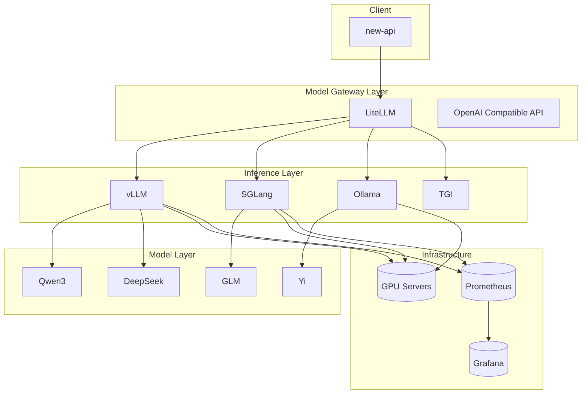
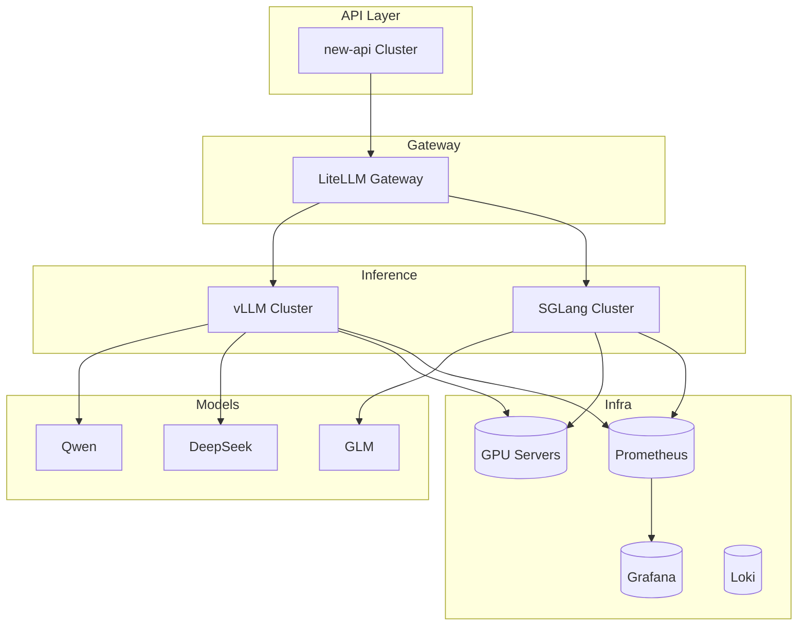

# 基于 new-api 的国产开源模型渠道部署实施方案（Dev → IDC 生产）

# 1. 项目目标

当前目标：

为 new-api 提供：

- 自建国产开源模型渠道
- OpenAI Compatible API
- 企业级可运维模型平台
- 支持后期生产 GPU 集群扩展

最终形成：

```text
new-api
   ↓
国产模型网关
   ↓
vLLM / Ollama / SGLang / TGI
   ↓
Qwen / DeepSeek / GLM 等模型
```

---

# 2. 总体实施阶段

建议分三阶段：

# 第一阶段：Dev 验证环境（Mac mini）

目标：

- 验证模型部署方式
- 验证 OpenAI API 兼容性
- 验证 new-api 对接
- 验证 Token 消耗
- 验证 Prompt / 输出效果
- 验证推理框架

特点：

- 单机
- 无 GPU（或 Apple Metal）
- 小规模模型
- 低成本

# 第二阶段：Pre-Prod 预生产

目标：

- 验证 GPU 部署
- 验证并发
- 验证显存占用
- 验证 Kubernetes 部署
- 验证监控

特点：

- 单台 GPU
- Docker/K8s
- 接近生产

# 第三阶段：IDC 生产环境

目标：

- 多模型生产部署
- 高可用
- 弹性扩展
- GPU 调度
- 企业级监控

特点：

- 多 GPU
- K8s
- 高可用
- 多租户

---

# 3. 推荐整体技术架构（生产级）



---

# 4. Dev 环境（Mac mini）实施方案

## 推荐硬件

建议：

### Mac mini M4 Pro

推荐：

- 48G 内存以上
- 1TB SSD

原因：

- Apple Metal 支持较好
- 本地运行 Qwen/DeepSeek 较稳定

---

## Dev 环境推荐方案

Mac 上：

不建议直接 vLLM。

推荐：

### Ollama（首选）

原因：

- 对 Apple Silicon 支持最好
- 部署最简单
- OpenAI API 兼容

---

## 部署步骤

### 安装 Ollama

官方：https://ollama.com

```bash
brew install ollama
ollama serve
```

### 下载模型

```bash
ollama run qwen3:8b
ollama run deepseek-r1:8b
```

### OpenAI API 测试

```bash
curl http://localhost:11434/v1/chat/completions \
-H "Content-Type: application/json" \
-d '{
  "model":"qwen3:8b",
  "messages":[
    {"role":"user","content":"hello"}
  ]
}'
```

### 对接 new-api

配置：

```text
Base URL:
http://macmini-ip:11434/v1
```

模型：

```text
qwen3:8b
```

---

# 5. Pre-Prod GPU 阶段

## 推荐方案

推荐：

### vLLM（首选）

原因：

- 高吞吐
- PagedAttention
- OpenAI API 原生兼容
- 行业标准

---

## 推荐 GPU

| 模型 | GPU |
|---|---|
| 7B | RTX 4090 / L40 |
| 14B | A100 80G |
| 32B | H100 |

---

## Docker 部署

```bash
docker run --runtime nvidia --gpus all \
-p 8000:8000 \
-v /models:/models \
vllm/vllm-openai:latest \
--model /models/Qwen3-14B
```

---

## new-api 对接

```text
http://vllm:8000/v1
```

模型：

```text
Qwen3-14B
```

---

# 6. IDC 生产环境方案

## 推荐整体架构



---

# 7. 为什么推荐 LiteLLM

作用：

- 统一 OpenAI API
- 模型路由
- fallback
- 限流
- 统一鉴权

推荐项目：

- https://github.com/BerriAI/litellm

---

# 8. Kubernetes 生产部署建议

| 组件 | 推荐 |
|---|---|
| GPU Operator | NVIDIA GPU Operator |
| Ingress | Nginx |
| Monitoring | Prometheus |
| Logging | Loki |
| Dashboard | Grafana |

---

# 9. GPU 调度建议

必须：

- GPU 独占
- NUMA 优化
- 显存监控
- GPU Utilization 监控

---

# 10. 模型推荐

## 第一阶段

| 模型 | 用途 |
|---|---|
| Qwen3-8B | 通用 |
| DeepSeek-R1-8B | 推理 |
| bge-m3 | Embedding |

## 第二阶段（IDC 生产，2026 最新国产开源模型）

| 模型 | 架构 | 参数量 | 用途 | 推荐推理框架 |
|---|---|---|---|---|
| Qwen3.5-397B-A17B | MoE | 397B 总 / 17B 激活 | 旗舰多语言多模态，通用高质量 | vLLM / SGLang |
| DeepSeek V4 Pro | MoE | ~1T 总 / 13B 激活 | 深度推理、代码、超长上下文（1M token）| vLLM（专家并行） |
| GLM-5.1 | MoE（est.） | 大参数（est.）| 中文优先、MIT 开源、可商业微调 | vLLM / llama.cpp |
| Kimi K2.6 | MoE | ~1T 总 / 32B 激活 | Agent 任务、SWE-Bench 编码、长上下文 256K | vLLM / SGLang / KTransformers |

## IDC 生产阶段推荐 GPU 配置

| 模型 | 推荐 GPU 配置 | 最小 VRAM | 说明 |
|---|---|---|---|
| Qwen3.5-397B-A17B | 4× H200 141G（Q4）/ 8× H100 80G | ~214 GB（Q4） | MoE，17B 激活，单节点 Q4 可运行 |
| DeepSeek V4 Pro | 8× H200 141G 起 / 多节点 H100 | ~1 TB（FP8） | 1T 参数，需专家并行，生产建议多节点 |
| GLM-5.1 | 8× H200 141G | ~860 GB（FP8） | 大参数 MoE，建议 FP8 + vLLM tensor parallel 8 |
| Kimi K2.6 | 8× H200 141G（INT4 QAT）/ 16× H100（FP16） | ~640 GB（INT4） | INT4 QAT 原生量化，质量损失极小，推荐 8× H200 |
| Qwen3.5-122B-A10B | 1× H100 80G（Q4）/ 2× H100（FP16） | ~70 GB（Q4） | 生产性价比最高，单节点可运行 |
| Qwen3.5-27B | 1× H100 80G | ~16 GB（Q4） | 轻量生产，适合路由 / 结构化提取辅助节点 |

> **选型建议**：
> - **成本优先**：Qwen3.5-122B-A10B（单 H100，性价比最高）
> - **极致质量**：Qwen3.5-397B-A17B（4× H200 Q4）
> - **编码 / Agent**：Kimi K2.6（8× H200 INT4）
> - **超长上下文 / 复杂推理**：DeepSeek V4 Pro（多节点 H200）
> - **中文私有化 / 可微调**：GLM-5.1（MIT 协议，8× H200）

---

# 11. 监控体系

必须监控：

- API QPS
- latency
- error rate
- GPU utilization
- GPU memory
- tokens/s
- queue length

---

# 12. 安全建议

必须：

- 模型服务仅内网暴露
- 仅暴露 new-api
- API Key 鉴权
- HTTPS
- 日志脱敏

---

# 13. 推荐最终架构

```text
用户
  ↓
new-api
  ↓
LiteLLM
  ↓
vLLM/SGLang
  ↓
Qwen/DeepSeek
```

---

# 14. 推荐实施路线

## 第1周

Mac mini：

- Ollama
- Qwen
- new-api 验证

## 第2周

GPU：

- vLLM
- Docker
- 压测

## 第3周

K8s：

- GPU Operator
- Prometheus
- Grafana

## 第4周

生产：

- IDC
- HA
- 监控
- 风控

---

# 15. 最终结论

推荐技术路线：

## Dev

```text
Mac mini + Ollama
```

## GPU

```text
vLLM
```

## 生产

```text
new-api
   ↓
LiteLLM
   ↓
vLLM Cluster
```

这是目前企业 AI SaaS 与私有化部署场景中，最主流、最稳定、最容易扩展的架构路线。

---

# 16. new-api 自身外置数据库多节点部署

new-api 默认使用内置 SQLite + 内存缓存，适合单机开发和测试。生产环境需要横向扩展时，必须切换为外置 MySQL + Redis 的多节点架构。

## 架构原理

```text
        负载均衡 (Nginx/HAProxy/ALB)
       /          |          \
  new-api-1   new-api-2   new-api-3  (NODE_TYPE=slave)
  (master)    (slave)     (slave)
       \          |          /
        外部 MySQL (共享存储)
        外部 Redis (共享缓存 / 分布式限流)
```

**关键点**：
- 所有节点共享同一个外部 MySQL 数据库
- 所有节点共享同一个外部 Redis 实例
- 只有一个 master 节点负责 DB 迁移和后台定时任务
- 所有节点必须设置相同的 `SESSION_SECRET` 和 `CRYPTO_SECRET`
- 前置负载均衡器分发请求到各节点的 3000 端口

## 为什么需要外置 MySQL

| 组件 | 默认（内置） | 多节点问题 |
|---|---|---|
| SQLite | 文件数据库，每节点独立 | 各节点数据完全隔离，用户/Token/渠道不同步 — **不可用** |
| 内存缓存 | 进程内缓存 | 限流计数不一致，Channel 粘性路由失效，用户缓存冗余 |
| Session | Cookie 存储（默认随机密钥） | 不同密钥导致节点间 Session 不互通 |

## 为什么需要外置 Redis

| 功能 | 无 Redis 时的行为 | 影响 |
|---|---|---|
| **限流**（API/Web/模型/下载） | 各节点独立计数 | 全局限流失效，无法统一管控 |
| **Channel 亲和性**（粘性路由） | 节点内 LRU 缓存 | 用户换节点后路由表错乱 |
| **用户/Token 缓存** | 每次查询数据库 | 功能正常但 DB 压力增大 |
| **设置项缓存** | 各节点独立从 DB 同步（默认 60s） | 有短暂不一致窗口，可接受 |

> **结论**：多节点部署**必须**同时使用外置 MySQL 和外置 Redis。

## 部署步骤

### 1. 准备外部 MySQL

```sql
CREATE DATABASE `new-api` CHARACTER SET utf8mb4 COLLATE utf8mb4_unicode_ci;
CREATE USER 'newapi'@'%' IDENTIFIED BY 'your_password';
GRANT ALL PRIVILEGES ON `new-api`.* TO 'newapi'@'%';
FLUSH PRIVILEGES;
```

注意：MySQL 版本需 >= 5.7.8，`max_connections` 需足够（建议 >= 总节点数 × `SQL_MAX_OPEN_CONNS` 的一半以上）。

### 2. 准备外部 Redis

```bash
# 设置密码认证
redis-cli CONFIG SET requirepass "your_redis_password"
```

### 3. 生成统一密钥（所有节点共用）

```bash
# 生成 256 位随机密钥
openssl rand -hex 32
```

### 4. 部署 Master 节点

```yaml
# docker-compose-mysql.yml（见仓库根目录）
services:
  new-api:
    image: calciumion/new-api:latest
    environment:
      - SQL_DSN=newapi:your_password@tcp(mysql_host:3306)/new-api
      - REDIS_CONN_STRING=redis://:your_redis_password@redis_host:6379
      - SESSION_SECRET=<步骤3生成的密钥>
      - CRYPTO_SECRET=<步骤3生成的密钥>
      - GIN_MODE=release
      - SQL_MAX_LIFETIME=300
      # Master 节点：不设 NODE_TYPE
```

### 5. 部署 Slave 节点

在 Master 配置基础上修改：

```yaml
    environment:
      # ... 同上所有配置 ...
      - NODE_TYPE=slave
      - FRONTEND_BASE_URL=http://master-node-ip:3000  # Slave 前端重定向到 Master
    # 可修改 ports 避免冲突：
    ports:
      - "3001:3000"
```

### 6. 配置负载均衡

Nginx 示例：

```nginx
upstream newapi_backend {
    server new-api-node-1:3000;
    server new-api-node-2:3001;
    server new-api-node-3:3002;
}

server {
    listen 80;
    server_name api.your-domain.com;

    location / {
        proxy_pass http://newapi_backend;
        proxy_set_header Host $host;
        proxy_set_header X-Real-IP $remote_addr;
        proxy_set_header X-Forwarded-For $proxy_add_x_forwarded_for;
        proxy_read_timeout 600s;  # LLM 流式响应时间较长
    }
}
```

## 关键环境变量速查

| 变量 | 用途 | 必须一致 | 默认值 |
|---|---|---|---|
| `SQL_DSN` | 外部 MySQL 连接串 | ✅ 所有节点 | 无（默认 SQLite） |
| `REDIS_CONN_STRING` | 外部 Redis 连接串 | ✅ 所有节点 | 无（默认内存缓存） |
| `SESSION_SECRET` | Cookie Session 加密密钥 | ✅ 所有节点 | 随机生成（单机） |
| `CRYPTO_SECRET` | 通用加密密钥 | ✅ 所有节点 | 同 SESSION_SECRET |
| `NODE_TYPE` | `slave` 跳过 DB 迁移和后台任务 | 按角色不同 | 空（= master） |
| `FRONTEND_BASE_URL` | Slave 前端重定向地址（非必须） | 仅 slave 需要 | 空 |
| `GIN_MODE` | 设为 `release` 关闭 Debug | 建议一致 | debug |
| `SQL_MAX_LIFETIME` | DB 连接存活时间（秒） | 可不同 | 60 |
| `REDIS_POOL_SIZE` | Redis 连接池大小 | 可不同 | 10 |

## docker-compose-mysql.yml

完整的生产级 compose 文件见仓库根目录 [docker-compose-mysql.yml](docker-compose-mysql.yml)，包含日志限制、资源限制、健康检查等生产最佳实践。

## 日志管理

- **Docker 日志**：配置了 `max-size: 10m` + `max-file: 3`，防止 JSON 日志撑满磁盘
- **应用日志**：写入 `./logs/` 目录，文件按 100 万行轮转，但**不会自动清理旧文件**，建议加 cron：
  ```bash
  0 3 * * * find /path/to/logs -name 'oneapi-*.log' -mtime +7 -delete
  ```

## Master/Slave 职责划分

| 职责 | Master | Slave |
|---|---|---|
| 处理 API 请求 | ✅ | ✅ |
| 数据库迁移 | ✅ | ❌ (跳过) |
| 后台任务（Midjourney 等） | ✅ | ❌ (跳过) |
| 前端页面 | ✅ | ❌ (重定向到 FRONTEND_BASE_URL) |
| Admin Dashboard | ✅ | ❌ (重定向) |
